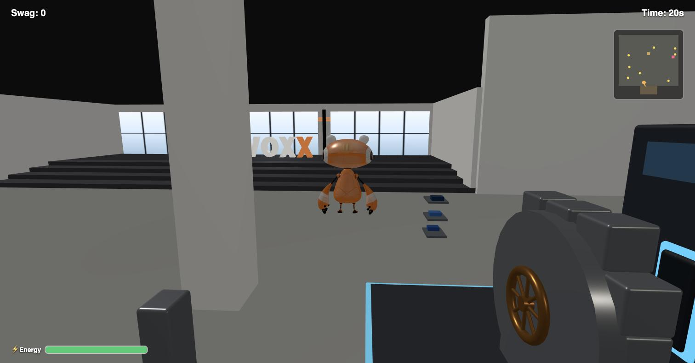
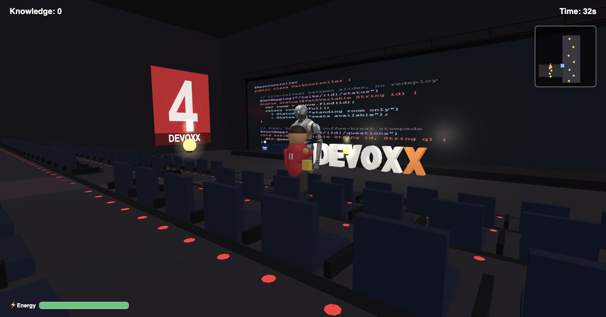
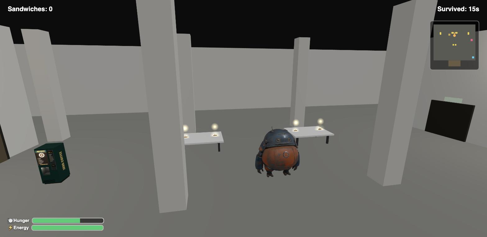

# A Day at Devoxx

A browser-based 3D game for Devoxx Belgium's **Robot Games** competition — one day at the
conference, told as three short levels, each starring a different robot in a different part of
Kinepolis Antwerp.

**Play it:** [devoxx-game.artisaweb.be](https://devoxx-game.artisaweb.be)

No install, no backend, no account — it's a static page that runs entirely in your browser.

---

## The three levels

The day runs in order. Levels 1 and 2 are timed; Level 3 has no timer and ends only when Biggy
goes down, so it doubles as the game's own high-score mode. Finishing it shows a per-robot
breakdown and a combined total for the whole day.

### 1. Voxxy — Swag Run



*Ground floor, the exhibition hall.* Voxxy is the quick, light one. Grab as much sponsor swag as
you can before the clock runs out, weaving between booths and the wandering crowd — an attendee
who walks into you knocks the last thing you picked up straight out of your hands.

### 2. Droid — Knowledge Run



*First floor, the auditorium level.* Droid is tall and deliberate. Collect one-liners of
conference wisdom scattered down a 180-metre corridor and up through auditorium 4's seating,
where every row is a real step you have to **jump** — the attendees chasing you climb them for
free. A bump topples Droid, and he is slow to get back up.

### 3. Biggy — Lunch Rush



*Ground floor again, redressed for lunchtime.* Biggy is heavy and slow, and every sandwich he eats
makes him permanently bigger, slower and harder to turn. Two things can end the run: his hunger
meter hitting zero, or three collisions landing close together once he's grown past a threshold.
The lunch queue is the hazard — walk too close to someone waiting, or eat a sandwich right under
their nose, and they'll break off and come after you.

> The Level 3 shot above is the opening moment, before the buffet stocks and the queue forms.

### Robots that have started acting human

Nothing any of the three robots does is a robot job. They are at a conference behaving exactly
like the people around them, and the whole game is built out of that one joke.

They **collect swag** they have no use for — caps, shirts, sunglasses, stickers, a crown, a
branded key, a drone — and wear it, stacking it up on their own bodies as the run goes on. Walk
into somebody and you drop the last thing you grabbed; they pick it up and start wearing it
themselves.

They **eat and drink.** Voxxy queues at the coffee machine and the candy kiosk to keep going.
Biggy works a lunch buffet, and every sandwich he eats makes him permanently rounder, slower and
easier to knock over — the hazard is the queue he keeps cutting into. All three will pull a beer
from the sponsor tap, and it makes them *tipsy*: the steering wanders, and a little mechanical bug
starts orbiting their head.

They **get tired.** Energy drains when they run and jump, and recharges from coffee, from candy,
from a charging pad on the floor — the robot equivalent of needing a break, and the actual
currency of Level 2, where Droid has sixteen rows of auditorium seating to jump.

And they **collect knowledge** — one-liners off a conference stage, which is the most human thing
in the building: a machine wandering a venue picking up wisdom it could have downloaded.

---

## Running it locally

```bash
npm install
npm run dev       # Vite dev server
npm run build     # tsc -b (typecheck) && vite build
npm run preview   # serve the production build
```

`npm run build` is also the project's only automated check — there's no test suite and no lint
config, but `tsc` runs in `strict` mode, so a build failure is a real failure.

### Controls

| Key | Action |
| --- | --- |
| `W` `A` `S` `D` / arrow keys | Move |
| `Shift` | Boost (drains energy) |
| `Space` | Jump (drains energy) |
| `R` | Restart the day, on the end screen |

Each level opens on a briefing panel and stays frozen until you press a movement key, so the
timer doesn't start while you're still reading.

### Debug shortcuts

These are gated to localhost and ignored on the hosted build:

| Query parameter | Effect |
| --- | --- |
| `?level=2` / `?level=3` | Jump straight to a level. Skipped levels honestly score 0. |
| `?x=&z=&heading=` | Drop the robot at an exact spot (heading in degrees). Height is always derived from the floor, never taken from the URL. |

A small readout in the bottom-right corner shows the live position; clicking it copies a debug URL
for wherever you're standing.

---

## How it's built

Vite + TypeScript + Three.js, client-only. No framework, no backend, no state that outlives the
tab except a personal-best score in `localStorage`.

- **One robot, three levels.** A single `Robot` instance persists across the whole day; level
  transitions swap its GLTF model and rig rather than building a new one. Each level is its own
  engine class (`SwagRun`, `KnowledgeRun`, `LunchRush`) with its own scene group, orchestrated by
  `core/Game.ts`.
- **Two floors, joined by doors.** The real venue's stairwells sit behind closed doors nobody
  walks through, so the floors are connected by door teleports instead of modelled staircases —
  which also lets each floor have a completely separate visual identity.
- **Geometry over asset packs.** The venue, the booths, the buffet, the vending machines and the
  DEVOXX letters are all generated as Three.js geometry in code. The only external model files are
  the three robots themselves (`public/models/*.glb`).
- **Sound is synthesised, not sampled.** `tools/gen_sfx.py` generates every `.wav` in
  `public/audio/` from oscillators and noise — run it with `python3 tools/gen_sfx.py` (needs
  `numpy`) to retune a sound.
- **Player-facing text lives apart from the code that shows it.** Dialogue, HUD copy, the
  knowledge quotes, robot toasts and venue signage each have their own file under `src/text/`.

The venue layout is a blockout of the real Kinepolis Antwerp — the hall proportions, the column
grid, the corridor of auditoriums upstairs and the three ways down off it are traced from the
floor plan rather than invented.

Sponsor booths and attendees reference real companies and real conference life by name and shape,
never by logo or trademark — a wink for people who recognise them, not a reproduction.

## Credits and licence

Built with heavy use of generative AI, deliberately and throughout: the code is vibecoded, the
robot models are AI-generated, and the sound effects are procedurally synthesised.

Source code is [MIT licensed](./LICENSE). The robot model assets in `public/models/` are
AI-generated. The competition's own reference robot assets are deliberately **not** used anywhere
in this entry.
